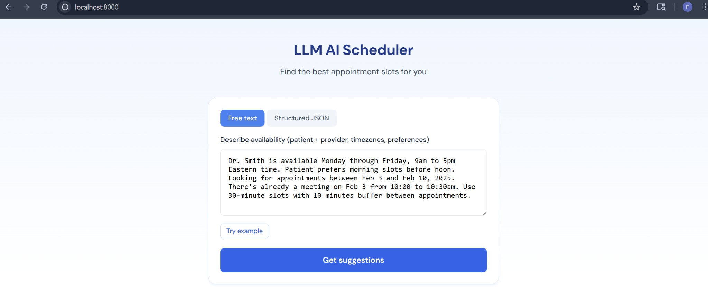
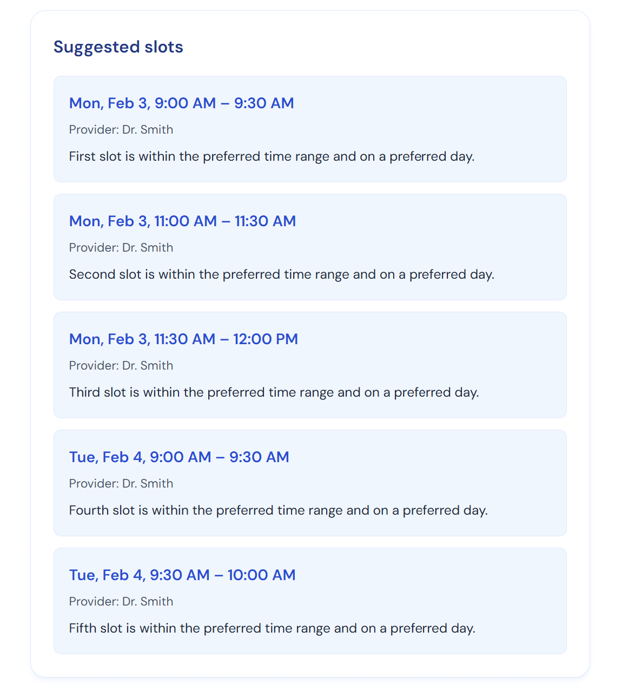

# LLM AI Scheduler

A local-only demo service that suggests appointment slots using a deterministic scheduler and LLM-powered parsing/explanations.

## Screenshots

**Input form** — Describe availability in free text or paste structured JSON:



**Suggested slots** — Top 5 slots with times, provider, and LLM-generated explanations:



## Features

- **POST /suggest** — Accepts either:
  - `availability_text`: Free text describing patient + provider availability (parsed by LLM)
  - `structured_availability`: Pre-normalized JSON
- **LLM integration** (OpenAI-compatible):
  - Converts free text to strict JSON schema
  - Generates 1–2 sentence explanations per suggested slot
  - Robust JSON extraction with Pydantic validation and retry on failure
- **Deterministic scheduler**:
  - Time zones (zoneinfo)
  - Slot length (default 30m), buffer between appointments (default 10m)
  - Excludes conflicts, respects business hours and preferred days/times
- **RAG (Ask)** — Ask questions about the scheduler; answers are generated from docs in `data/documents/` (e.g. `scheduler_faq.md`)
- **Patient Documents RAG** — Upload patient medical records (.txt or .md) and ask questions about them

## Requirements

- Python 3.11+
- OpenAI API key (or compatible endpoint)

## Setup

```bash
# Create virtual environment
python -m venv .venv
source .venv/bin/activate   # Linux/macOS
# or: .venv\Scripts\activate   # Windows

# Install dependencies
pip install -r requirements.txt

# Environment variables
export OPENAI_API_KEY="sk-..."
export OPENAI_BASE_URL="https://api.openai.com/v1"   # optional, for custom endpoints
export OPENAI_MODEL="gpt-4o-mini"                    # optional, default model
```

## Run

```bash
# Using uvicorn directly
uvicorn app.main:app --reload --host 0.0.0.0 --port 8000

# Or with Makefile
make run
```

Then open **http://localhost:8000** in your browser for the web UI.

## FAQ

### What is the LLM AI Scheduler?

The LLM AI Scheduler is a demo service that suggests appointment slots. You can describe your availability in plain English, and it uses AI to parse your text and recommend the best times.

### How do I describe my availability?

You can use free text like: "Dr. Smith is available Monday through Friday, 9am to 5pm Eastern. Patient prefers mornings. Looking between Feb 3 and Feb 10, 2025."

Include: provider hours, timezone, preferred days or times, date range, and any existing appointments to avoid.

### What timezone formats are supported?

Use IANA timezone names, for example: America/New_York, America/Los_Angeles, Europe/London, UTC. The scheduler handles timezone conversion automatically.

### What are slot length and buffer?

- **Slot length** (default 30 minutes): How long each appointment lasts.
- **Buffer** (default 10 minutes): Gap required between appointments. If you have a meeting at 10:00–10:30, the next slot cannot start before 10:40.

### Do I need an API key?

Yes. Set OPENAI_API_KEY in your environment. The service uses OpenAI (or compatible) models to parse free text and generate slot explanations.

### Can I use structured JSON instead of free text?

Yes. Switch to the "Structured JSON" tab and paste a JSON object with provider_id, timezone, business_hours, date_range, existing_appointments, and optional preferred_days and preferred_times.

### How many slots does it return?

The scheduler returns the top 5 available slots that fit your constraints. Each slot includes an AI-generated explanation of why it was chosen.

## Test

```bash
pytest tests/ -v

# Or with Makefile
make test
```

## API Examples

### 1. RAG — Ask a question about the scheduler

```bash
curl -X POST http://localhost:8000/ask \
  -H "Content-Type: application/json" \
  -d '{"question": "What timezone formats are supported?"}'
```

### 2. Upload patient documents

```bash
curl -X POST http://localhost:8000/upload \
  -F "file=@patient_record.md"
```

### 3. RAG — Ask a question about patient documents

```bash
curl -X POST http://localhost:8000/ask_patient \
  -H "Content-Type: application/json" \
  -d '{"question": "What medications is the patient taking?"}'
```

### 4. Free-text availability

```bash
curl -X POST http://localhost:8000/suggest \
  -H "Content-Type: application/json" \
  -d @data/sample_requests/text_availability.json
```

### 5. Structured JSON availability

```bash
curl -X POST http://localhost:8000/suggest \
  -H "Content-Type: application/json" \
  -d @data/sample_requests/structured_availability.json
```

## Project Structure

```
llm-ai-scheduler/
├── docs/
│   ├── ui.png        # Input form screenshot
│   └── results.png   # Suggested slots screenshot
├── data/
│   ├── documents/
│   │   └── scheduler_faq.md   # Example doc for RAG
│   ├── patient_docs/          # Uploaded patient documents for RAG
│   └── sample_requests/
├── app/
│   ├── __init__.py
│   ├── main.py       # FastAPI app, POST /suggest, POST /ask
│   ├── llm.py        # LLMClient (OpenAI-compatible)
│   ├── rag.py        # RAG: retrieve + generate from docs
│   ├── schema.py     # Pydantic models
│   └── scheduler.py  # Deterministic slot computation
├── tests/
│   ├── test_scheduler.py   # Scheduler unit tests
│   └── test_llm_parsing.py # Mocked LLM parsing tests
├── requirements.txt
├── Makefile
└── README.md
```

## License

MIT
